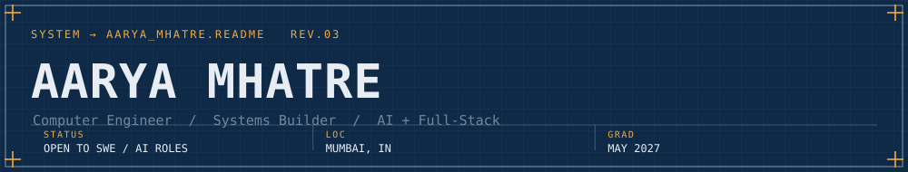

 

  
  &nbsp;
  
  &nbsp;
  
  &nbsp;
  
  

 

<table>
  <tr>
    <td valign="top" width="34%">
      
      
<code>FIG.2 &#8212; SUBJECT (unverified biometric sample)</code>

    </td>
    <td valign="top" width="66%">
      
    </td>
  </tr>
</table>

 

 

I build **AI-powered systems** and **full-stack applications** &#8212; the kind that solve real problems, not just pass demos. The diagram above isn't decoration: it's the actual shape of the work &#8212; each role produced the systems wired to it.

---

### `NOTES.md`

<table>
<tr><td width="100%">

**AM-01 // InfinityPool branch**
Built **Shankh**, a browser-native WebAR financial chatbot across 15 Indic languages &#8212; lip-synced 3D avatar (modelled in Blender, wired through Unity), RAG-augmented AI, real-time stock signals, voice input via Whisper. **94% language-detection accuracy** in production. Avatar pipeline, NLP backend, multilingual orchestration &#8212; all mine.

</td></tr>
<tr><td width="100%">

**AM-01 // MGL branch**
Two GIS systems for Maharashtra's gas infrastructure. **PNG Expansion Recommender**: ranks 1,073 streets by expansion opportunity (Greenfield / Deepening / Anchor), Leaflet heatmap synced to a priority table, AI-generated zone narratives, drag-and-drop plan builder with CSV export. **CNG Zone Eligibility System**: public point-in-polygon eligibility checker + admin dashboard with live infrastructure map, filterable request log with Excel export, adjustable-radius nearby-station lookup.

</td></tr>
<tr><td width="100%">

**AM-01 // independent branch**
**AI-Powered Vehicle Analytics System** &#8212; real-time license-plate detection and speed estimation from video streams (YOLOv5 + OpenCV). **92%+ detection accuracy** after tuning and evaluation.

</td></tr>
<tr><td width="100%">

**AM-01 // IISER Mohali branch**
15-day ML research placement &#8212; data preprocessing, feature engineering, and model evaluation on real-world datasets at one of India's top science institutes.

</td></tr>
</table>

---

### `COMPONENTS.lib`

---

<code>README.md &gt; more --verbose</code>

 

I believe in **shipping > perfecting**. Every repo here is something I built because I wanted it to exist, not to pad a portfolio.

&nbsp;&nbsp;🏋️&nbsp; Gym is where I think. Both require consistency over bursts.
&nbsp;&nbsp;📸&nbsp; Photography &#8212; I shoot what most people walk past.
&nbsp;&nbsp;🎧&nbsp; Music is a constant. Always on, always something different.
&nbsp;&nbsp;🤝&nbsp; Volunteering &#8212; building for community is the whole point.

**Leadership & recognition**
Secretary, AI & Deep Learning Club (AIDL), FCRIT &#183; organised Hackquinox 2.0 (national-level hackathon) &#183; Smart India Hackathon participant &#183; First Prize, Poster Presentation Competition &#183; Applied Data Science (IBM), ML Foundations (Google), Generative AI (Google Cloud), Product Management Simulation (Forage)

 

B.Tech Computer Engineering &#183; AI/ML Honours &#183; Fr. C. Rodrigues Institute of Technology, Vashi
  
Recruiters &#8594; <strong><a href="https://www.linkedin.com/in/aarya-mhatre-3b98a7289/">LinkedIn</a></strong> is where I'm active.

