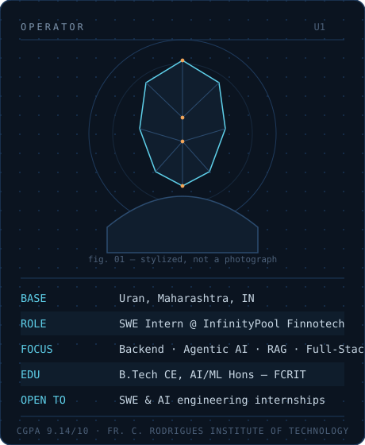

 

  
  &nbsp;
  
  &nbsp;
  

 

<table>
<tr>
<td width="38%" valign="top">

</td>
<td width="62%" valign="top">

 
<table>
<tr>
<td width="52%">

</td>
<td width="48%">

</td>
</tr>
</table>
</td>
</tr>
</table>

 

### `STACK.cfg`

LLM &amp; agentic layer &#8212; OpenAI APIs &#183; LangGraph &#183; RAG &#183; Prompt Engineering &#183; n8n

 

### `BUILD_LOG`

**AM-01 // InfinityPool branch** &#183; Jun 2025 &#8212; Present
Building **Shankh**, a browser-native WebAR financial chatbot spanning 15+ Indic languages &#8212; lip-synced 3D avatar (Blender &#8594; Unity), RAG-based retrieval, real-time market signals, voice input via Whisper. `94% language-detection accuracy` in production.
Proprietary codebase &#8212; not public. Ask me for a walkthrough.

**AM-01 // Mahanagar Gas branch** &#183; Jun &#8212; Jul 2026
Two GIS systems for Maharashtra's gas infrastructure: a **PNG Expansion Recommender** ranking 1,073+ streets by opportunity type, with a Leaflet heatmap synced to a priority table, AI-generated zone narratives, and a drag-and-drop plan builder with CSV export; plus a **CNG Zone Eligibility System** &#8212; a public point-in-polygon checker paired with an admin dashboard and live infrastructure map.

**AM-01 // independent branch**
**AI-Powered Vehicle Analytics System** &#8212; real-time license-plate detection and speed estimation from video streams, built on YOLOv5 + OpenCV. `92%+ detection accuracy` after tuning and evaluation on controlled datasets.
Private repository.

 

**Other builds** &#8212; smaller repos, all public:

 

### `EXPERIENCE.log`

| Period | Org | Role |
|---|---|---|
| Jun 2025 &#8212; Present | InfinityPool Finnotech Pvt. Ltd. | Software Engineering Intern |
| Jun 2026 &#8212; Jul 2026 | Mahanagar Gas Limited (MGL) | Software Engineering Intern |
| Jun 2025 | IISER Mohali | Machine Learning Intern |

 

### `README.md > more --verbose`

Leadership &amp; achievements

 

**Leadership**
- Secretary, Artificial Intelligence &amp; Deep Learning Club (AIDL), FCRIT
- Organized **HackQuinox 2.0**, a national-level hackathon with multi-college and industry participation
- Led planning for technical workshops, coding events, and AI-focused activities

**Achievements**
- First Prize &#8212; Poster Presentation Competition (AY 2025&#8211;26)
- Participant &#8212; Smart India Hackathon (SIH), internal/national selection

**Certificates**
- Applied Data Science with Python &#8212; IBM
- Machine Learning Foundations &#8212; Google
- Introduction to Generative AI &#8212; Google Cloud
- Product Management Simulation &#8212; Forage

 

 

B.Tech Computer Engineering &#183; AI/ML Honours &#183; Fr. C. Rodrigues Institute of Technology, Vashi
  
Recruiters &#8594; <strong><a href="https://www.linkedin.com/in/aarya-mhatre-3b98a7289/">LinkedIn</a></strong> is where I'm active &#183; also on <a href="https://www.instagram.com/aarya_mhatre69/">Instagram</a>

