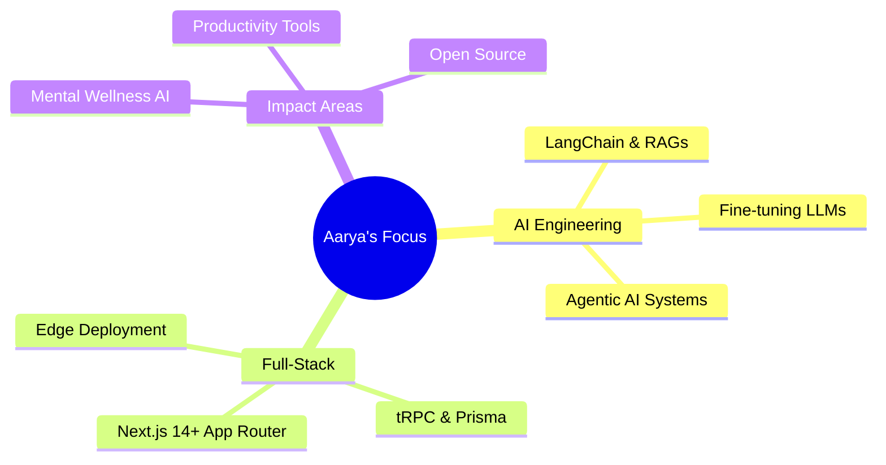

<div align="center">

<!-- ═══════════════════════════════════════════════════════════════ -->
<!--                     ANIMATED HEADER BANNER                      -->
<!-- ═══════════════════════════════════════════════════════════════ -->


</div>

<!-- ═══════════════════════════════════════════════════════════════ -->
<!--                     TYPING ANIMATION                            -->
<!-- ═══════════════════════════════════════════════════════════════ -->

<div align="center">

[](https://git.io/typing-svg)

</div>

<!-- ═══════════════════════════════════════════════════════════════ -->
<!--                     QUICK CONNECT BADGES                        -->
<!-- ═══════════════════════════════════════════════════════════════ -->

<div align="center">

[](https://www.linkedin.com/in/aarya-mhatre-3b98a7289/)
[](mailto:aaryamhatre69@gmail.com)
[](https://www.instagram.com/aarya_mhatre69/)
[](https://your-portfolio.com)
[](https://github.com/Aarya-Mhatre69)

</div>

<br/>

<!-- ═══════════════════════════════════════════════════════════════ -->
<!--                     ABOUT ME SECTION                            -->
<!-- ═══════════════════════════════════════════════════════════════ -->

##  &nbsp; About Me


```yaml
name       : Aarya Mhatre
role       : AI Engineer & Full-Stack Developer
location   : India 🇮🇳
focus      : Intelligent · Scalable · Ethical Tech

currently_exploring:
  - LangChain + RAG Pipelines       🤖
  - AI Chatbots & Fine-tuned LLMs   🧬
  - React.js & Next.js Ecosystems   ⚛️
  - Computer Vision with OpenCV     👁️

mission    : AI for Mental Wellness & Human Impact 🌍
philosophy : "Every commit is a step forward 💪"

when_not_coding:
  - 🏋️‍♂️ Crushing it at the gym
  - 🎧 Finding flow with music
  - 📚 Learning something new daily
```

<br clear="right"/>

<!-- ═══════════════════════════════════════════════════════════════ -->
<!--                     SKILLS SECTION                              -->
<!-- ═══════════════════════════════════════════════════════════════ -->

##  &nbsp; Tech Toolbox

<div align="center">

### 🧠 AI / ML Stack


### 🌐 Frontend


### ⚙️ Backend & Databases


### 🛠️ Tools & DevOps


</div>

<!-- ═══════════════════════════════════════════════════════════════ -->
<!--                     EXPERTISE METER                             -->
<!-- ═══════════════════════════════════════════════════════════════ -->

## 📊 &nbsp; Expertise Breakdown

```text
AI / ML Engineering      ███████████████░░░░░   72%
Full-Stack Development   █████████████░░░░░░░   64%
LangChain / RAG / LLMs   ████████████░░░░░░░░   58%
React / Next.js          █████████████░░░░░░░   65%
Computer Vision          ██████████░░░░░░░░░░   50%
System Design            █████████░░░░░░░░░░░   44%
```

<!-- ═══════════════════════════════════════════════════════════════ -->
<!--                     GITHUB STATS                                -->
<!-- ═══════════════════════════════════════════════════════════════ -->

## 🏅 &nbsp; GitHub Statistics

<div align="center">


<br/>


</div>

<!-- ═══════════════════════════════════════════════════════════════ -->
<!--                     ACTIVITY GRAPH                              -->
<!-- ═══════════════════════════════════════════════════════════════ -->

## 📈 &nbsp; Contribution Activity

<div align="center">

[](https://github.com/ashutosh00710/github-readme-activity-graph)

</div>

<!-- ═══════════════════════════════════════════════════════════════ -->
<!--                     TROPHIES                                    -->
<!-- ═══════════════════════════════════════════════════════════════ -->

## 🏆 &nbsp; GitHub Trophies

<div align="center">

[](https://github.com/ryo-ma/github-profile-trophy)

</div>

<!-- ═══════════════════════════════════════════════════════════════ -->
<!--                     PROJECTS SHOWCASE                           -->
<!-- ═══════════════════════════════════════════════════════════════ -->

## 🚀 &nbsp; Featured Projects

<div align="center">

| 🧠 Project | 📝 Description | 🛠️ Stack |
|:---:|:---:|:---:|
| **MindEase AI** | AI-powered mental wellness companion using RAG | `LangChain` `Python` `React` |
| **VisionBot** | Computer vision-based real-time object detection app | `OpenCV` `PyTorch` `FastAPI` |
| **CodePilot** | AI code review assistant with LLM integration | `Next.js` `OpenAI API` `TypeScript` |
| **ChatStack** | Full-stack realtime chat app with auth & rooms | `Node.js` `MongoDB` `Socket.io` |

> 💡 *More projects dropping soon — the build never stops.*

</div>

<!-- ═══════════════════════════════════════════════════════════════ -->
<!--                     CURRENT LEARNING                            -->
<!-- ═══════════════════════════════════════════════════════════════ -->

## 🌱 &nbsp; Currently Learning & Building

<div align="center">



</div>

<!-- ═══════════════════════════════════════════════════════════════ -->
<!--                     FUN FACTS                                   -->
<!-- ═══════════════════════════════════════════════════════════════ -->

## ⚡ &nbsp; Random Facts About Me

<table align="center">
  <tr>
    <td>🏋️‍♂️</td><td>Gym sessions = debugging sessions. Both require focus and reps.</td>
  </tr>
  <tr>
    <td>🎧</td><td>Music is my background process — always running.</td>
  </tr>
  <tr>
    <td>💡</td><td>I build AI tools as I learn them. Shipping > perfecting.</td>
  </tr>
  <tr>
    <td>🌍</td><td>Dream: Use AI to make mental healthcare accessible to everyone.</td>
  </tr>
  <tr>
    <td>📚</td><td>Reading one new tech paper or article every single day.</td>
  </tr>
  <tr>
    <td>🔥</td><td>Beginner with a big vision — and the work ethic to match.</td>
  </tr>
</table>

<!-- ═══════════════════════════════════════════════════════════════ -->
<!--                     QUOTE                                       -->
<!-- ═══════════════════════════════════════════════════════════════ -->

## 💬 &nbsp; Dev Mantra

<div align="center">

> *"The best way to predict the future is to build it."*
> — Alan Kay

</div>

<!-- ═══════════════════════════════════════════════════════════════ -->
<!--                     FOOTER                                      -->
<!-- ═══════════════════════════════════════════════════════════════ -->

<br/>

<div align="center">


</div>

<div align="center">

**✨ Thanks for visiting! If you like what you see, drop a ⭐ on something! ✨**

*Built with ❤️ + ☕ + 🎧 by **Aarya Mhatre***

</div>
