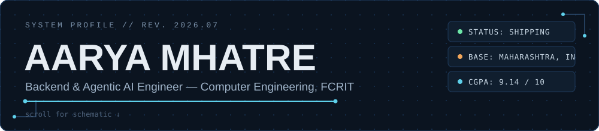
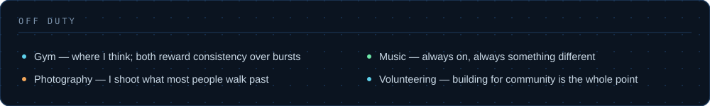

 

&nbsp;
&nbsp;
&nbsp;

 

<table>
<tr>
<td width="36%" valign="top">

</td>
<td width="64%" valign="top">

### `ABOUT.md`

I build **AI-powered systems** and **full-stack applications** — the kind
that solve real problems, not the kind that just pass demos. Recent work
spans a multilingual AI voice assistant, two GIS platforms for gas
infrastructure planning, and a computer-vision pipeline for traffic
analytics — usually front to back, mine end to end.

I believe in **shipping > perfecting**. Every repo here exists because I
wanted it to, not to pad a portfolio.

 

</td>
</tr>
</table>

 

### `STACK.cfg`

LLM &amp; agentic layer &#8212; OpenAI APIs &#183; LangGraph &#183; RAG &#183; Prompt Engineering &#183; n8n

 

### `BUILD_LOG`

> **AM-01 // InfinityPool branch** &nbsp;·&nbsp; Jun 2025 — Present
> Building **Shankh**, a browser-native WebAR financial chatbot spanning 15+
> Indic languages — lip-synced 3D avatar (Blender → Unity), RAG-based
> retrieval, real-time market signals, voice input via Whisper.
> `94% language-detection accuracy` in production.
> Proprietary codebase — not public, happy to walk through it.

> **AM-01 // Mahanagar Gas branch** &nbsp;·&nbsp; Jun — Jul 2026
> Two GIS systems for Maharashtra's gas infrastructure: a **PNG Expansion
> Recommender** ranking 1,073+ streets by opportunity type, with a Leaflet
> heatmap synced to a priority table, AI-generated zone narratives, and a
> drag-and-drop plan builder with CSV export — plus a **CNG Zone
> Eligibility System**, a public point-in-polygon checker paired with an
> admin dashboard and live infrastructure map.

> **AM-01 // independent branch**
> **AI-Powered Vehicle Analytics System** — real-time license-plate
> detection and speed estimation from video streams, built on YOLOv5 +
> OpenCV. `92%+ detection accuracy` after tuning and evaluation.
> Private repository.

> **AM-01 // IISER Mohali branch** &nbsp;·&nbsp; Jun 2025
> 15-day ML research placement — data preprocessing, feature engineering,
> and model evaluation on real-world datasets.

 

**Public repos:**

 

### `EXPERIENCE.log`

| Period | Org | Role |
|---|---|---|
| Jun 2025 — Present | InfinityPool Finnotech Pvt. Ltd. | Software Engineering Intern |
| Jun 2026 — Jul 2026 | Mahanagar Gas Limited (MGL) | Software Engineering Intern |
| Jun 2025 | IISER Mohali | Machine Learning Intern |

 

### `README.md > more --verbose`

Leadership &amp; achievements

 

**Leadership**
- Secretary, Artificial Intelligence &amp; Deep Learning Club (AIDL), FCRIT
- Organised **HackQuinox 2.0**, a national-level hackathon with multi-college and industry participation
- Led planning for technical workshops, coding events, and AI-focused activities

**Achievements**
- First Prize — Poster Presentation Competition (AY 2025–26)
- Participant — Smart India Hackathon (SIH)

**Certificates**
- Applied Data Science with Python — IBM
- Machine Learning Foundations — Google
- Introduction to Generative AI — Google Cloud
- Product Management Simulation — Forage

 

 

B.Tech Computer Engineering &#183; AI/ML Honours &#183; Fr. C. Rodrigues Institute of Technology, Vashi
  
Recruiters &#8594; <strong><a href="https://www.linkedin.com/in/aarya-mhatre-3b98a7289/">LinkedIn</a></strong> is where I'm active

