<div align="center">
  
</div>
<br/>
<div align="center">
  <a href="https://www.linkedin.com/in/aarya-mhatre-3b98a7289/">
    
  </a>
  &nbsp;
  <a href="mailto:theaaryamhate@gmail.com">
    
  </a>
  &nbsp;
  <a href="https://www.instagram.com/aarya_mhatre69/">
    
  </a>
  &nbsp;
  
</div>

---

<div align="center">

<h3><code>aarya@github ~ $ ./contributions.sh</code></h3>


<br><br>

<h3><code>aarya@github ~ $ whoami</code></h3>
<table>
  <tr>
    <td valign="top"></td>
    <td valign="top"></td>
  </tr>
</table>

</div>

---

Third year. Computer Engineering, AI/ML track. FCRIT, Vashi.

I build **AI-powered systems** and **full-stack applications** - the kind that solve real problems, not just pass demos. Most of my work lives somewhere between LLM pipelines, backend APIs, and interfaces people actually want to use.

```
📍 Mumbai, India  ·  🎯 Open to SWE & AI Engineering roles  ·  🎓 Graduating May 2027
```

---

### Work

**Software Engineering Intern &nbsp;·&nbsp; InfinityPool Finnotech Pvt Ltd** &nbsp;`· 1 year`

Built **Shankh** - a browser-native WebAR financial chatbot. 15 Indic languages. A lip-synced 3D avatar I modelled in Blender and wired through Unity. Real-time stock signals, RAG-augmented AI, voice input via OpenAI Whisper. Runs entirely in a browser - no app, no install, just a URL. Hit **94% language detection accuracy** in production.

The full stack was mine: avatar pipeline, NLP backend, multilingual orchestration, everything. That year taught me what shipping actually means.

<br/>

**ML Intern &nbsp;·&nbsp; IISER Mohali** &nbsp;`· 15 days`

Research exposure at one of India's top science institutes. Worked on ML model development and real-world data pipelines. Short, but the kind of dense that sticks.

<br/>

**Software Engineering Intern &nbsp;·&nbsp; Mahanagar Gas Limited (MGL)** &nbsp;`· Jun–Jul 2026`

Built two GIS-based systems for Maharashtra's gas infrastructure: an AI-powered PNG Expansion Recommendation System (geospatial analytics + interactive dashboards to flag high-potential expansion zones) and a CNG Station Eligibility & Planning System (admin dashboards, location-based analysis, live map visualizations). Details on both in **Projects** below.

---

### Projects

**MGL PNG Expansion Recommender** &nbsp;`· Node/Express + React`

Internal decision-support dashboard for Maharashtra Gas Limited: ranks postal zones by PNG (piped gas) expansion opportunity across 1,073 streets, classifying each as Greenfield / Deepening / Anchor. Interactive Leaflet heatmap synced to a sortable priority table, AI-generated expansion narratives per zone (Gemini), and a drag-and-drop plan builder with CSV export. Full-stack: SQLite, Express API, React/Vite frontend, Haversine-based cost modeling.

<br/>

**CNG Zone Eligibility System** &nbsp;`· ASP.NET Core + SQL Server`

Public-facing + admin web app for MGL's CNG distribution network. Citizens check real point-in-polygon eligibility against actual zone boundaries; internal staff get a live infrastructure map, a filterable request log with Excel export, and a request-detail view with an adjustable-radius (2/5/10km) nearby-station lookup. Built on ASP.NET Core MVC + EF Core (hand-mapped schema) with Leaflet + Turf.js for all spatial logic.

<br/>

**Shankh** &nbsp;`· Unity + Whisper + RAG`

Browser-native WebAR financial chatbot — see **Work** above.

<br/>

**AI-Powered Vehicle Analytics System** &nbsp;`· YOLOv5 + OpenCV`

Computer vision pipeline that detects vehicle license plates and estimates vehicle speed from video streams in real time — detection, tracking, and speed estimation end to end. Hit **92%+ license plate detection accuracy** after tuning and evaluation on controlled datasets.

---

### Stack

<div align="center">

</div>

---

### A bit more

I believe in **shipping > perfecting**. Every repo here is something I built because I wanted it to exist - not to pad a portfolio.

> *"The best way to predict the future is to build it."*

&nbsp;&nbsp;&nbsp;&nbsp;🏋️‍♂️ &nbsp; Gym is where I think. Both require consistency over bursts.
&nbsp;&nbsp;&nbsp;&nbsp;📸 &nbsp; Photography - I shoot what most people walk past.
&nbsp;&nbsp;&nbsp;&nbsp;🎧 &nbsp; Music is a constant. Always on, always something different.
&nbsp;&nbsp;&nbsp;&nbsp;🤝 &nbsp; Volunteering - building for community is the whole point.

---

### Recognition

🛠️ &nbsp; Organised **Hackquinox 2.0** - National Level Hackathon
💡 &nbsp; Participated in **Smart India Hackathon (SIH)**
📜 &nbsp; Applied Data Science - IBM &nbsp;·&nbsp; ML Foundations - Google &nbsp;·&nbsp; Generative AI - Google Cloud

---

<div align="center">
<br/>
<sub>B.Tech Computer Engineering · AI/ML Honours · Fr. C. Rodrigues Institute of Technology, Vashi</sub>
<br/><br/>
<sub>If you're a recruiter, <strong><a href="https://www.linkedin.com/in/aarya-mhatre-3b98a7289/">LinkedIn</a></strong> is where I'm active. Come say hi.</sub>
<br/><br/>

</div>
